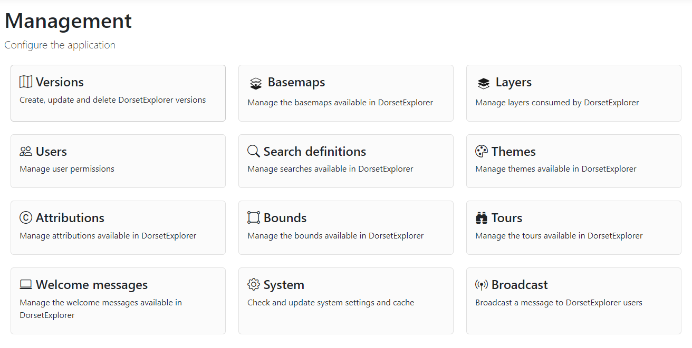

# Getting started with the management interface

As an admin, you have access to the managment interface for GIFramework Maps. This is where you can configure the application, including adding new layers, creating new colour themes, adding tours and more.

When you log in, you should see an option for **Manage application** underneath your username. This will take you to the management interface.

<figure markdown>
{width="650"}
  <figcaption>The management interface for GIFramework Maps</figcaption>
</figure>