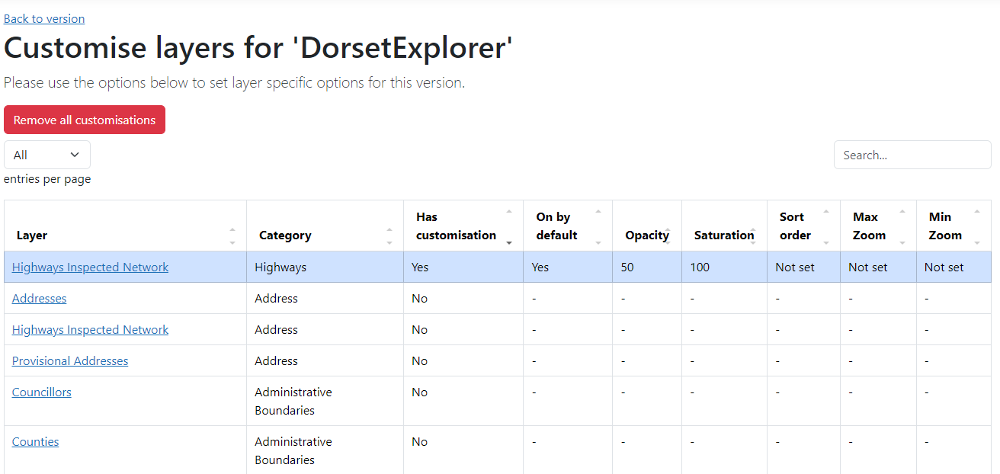

# Versions

Versions are the best way to split maps up into different themes, with different layers, permissions and functionality.

## Add a new version

Select **Create new version** and fill in the details:

- Name
- Slug - the bit at the end of the URL. See [slugs](#slugs) for more information
- Description (optional) - A friendly description that is shown to users and put in the metadata of the version
- Version Notes (optional) - A description for administrators about this version
- Theme - the [theme](../gui/themes.md) you want your version to use
- Start extents - the [bound](../gui/bounds.md) to set the map to
- Enabled - sets whether the version is enabled or not
- Require login - choose whether you want the version to require a user to login to use it
- Welcome message (optional) - the [welcome message](../gui/welcome-messages.md) you want your version to use
- Tour (optional) -  the [tour](../gui/tours.md) you want your version to use
- Show login option - choose whether you want to show an option for users to login
- Show as a featured version - choose whether you want the version to be featured at the top of the version home page. Leaving this unchecked will put the version with all other versions underneath
- Hide from version home page - choose if you want to hide the version on the version home page (if you hide a version, it can still be accessed directly by its URL)
- Help URL (optional) - include a link to custom documentation
- Feedback URL (optional) - include a link to a feedback form
- Redirection URL (optional) - a URL to redirect the user to instead of loading the version. Can be useful if a version changes slug, or you want to point people elsewhere
- Purge memory cache on save? - ticking this box will purge the cache and allow your version to be available for testing or use straight away
- Version image URL (optional) - include a URL to an image to use on the version home page. Leaving this blank will use a default image of the world instead
- Purge cache - ticking this box will purge the cache and allow your version to be available for testing or use straight away

On the right side of the screen, you'll see options for:

- Basemaps - choose which basemaps you want to include in your version and which one you want to set as the default
- [Projections](../gui/system.md#projections) - choose which projections are available and what the default map and viewing projection is
- [Categories](../gui/layers.md#layer-categories) - choose which layer categories you want to include in your version

## Edit a version

Select the version you want to edit. Make the changes you want and hit Save.

On the right side of the screen you will also see new options for:

- [Layer customisations](#layer-customisations) - allows you to customise how individual layers are configured for this specific version only
- [Version contacts](#version-contacts) - add users who are considered a 'contact' for the version

## Delete a version

Select the version you want to delete. You will be asked if you're sure, press Delete again to confirm.

## Slugs

Slugs are the bit on the end of your application URL which direct you to different versions of GIFramework Maps. You can have a maximum of three slugs seperated by forward slashes. 

By default, there should be one called 'general' which is where you will be directed if you have no slug on your URL.

!!! danger "Reserved slugs"
    There are a number of slugs that are reserved for use by the GIFramework Maps application. Using these will not work and may cause other unintended consequences. 
    
    - `general`
    - `account`
    - `api`
    - `print`
    - `search`
    - `broadcasthub`
    - `css`
    - `img`
    - `lib`

    You should not use these as the first part of the slug, regardless of any additional parts you put on the end, e.g. `lib/myversion` is **not** valid

!!! example "Examples"
    'general' -> Root of application e.g. `https://<your-application-root>/`

    'highways' -> `https://<your-application-root>/highways`

    'very/long/slug' -> `https://<your-application-root>/very/long/slug`

# Layer customisations

Layer customisations allow you to customise how individual layers are configured for this specific version only. The most common use is to turn one or many layers on by default, so users don't have to switch them on themselves, but you can also set the starting opacity/saturation, set the zoom levels and change where it appears within its category.

You will be shown a list of all layers that are currently enabled in your version. Any that already have customisation will be at the top and highlighted.
<figure markdown>
{width="650"}
  <figcaption>The layer customisations table for a version</figcaption>
</figure>

Choose a layer you want to customise and you'll be taken to the customisations screen. You can set the following options on the layer:
- On by default - Check to make this layer be switched on by default when the user opens this version
- Minimum viewable zoom level - Set the minimum viewable zoom level. Zooming out beyond this level will switch the layer off automatically
- Maximum viewable zoom level - Set the maximum viewable zoom level. Zooming in beyond this level will switch the layer off automatically
- Sort order within category - Change the position it appears sorted in within its folder
- Default opacity - Set the default opacity of the layer
- Default saturation - Set the default saturation of the layer

!!! note
    Setting 'On by default' on a layer will override a users share link and always turn on the layer, so use with caution

If you are editing an existing customisation, you can also delete the customisation using the Delete button.

Every layer customisation applied to a version can be removed in one go by going to the Layer Customisations list and choosing 'Remove all custonisations'.

# Version contacts

Version contacts allow you to add one or many users as 'contacts' for the version. This could be for any reason, such as being the named person in charge of the version, or an interested party. Administrators can then use this list to quickly get in touch with relevant people for a version.

Go the edit screen of a version, and choose the 'Version contacts' button on the right. You will be shown a list of any existing contacts and a button to add a contact entry.

## Adding or editing a contact

When you add a user, you can choose to provide a friendly name to identify them to administrators, in case the name provided by the identity provider is different.

!!! note
    The list of users comes from the list of users provided by your identity provider. There is no way at this time to add users who are not part of this list.

You can check the 'Enable alerts for user' to make sure they are included in any emails or any future automated alert functionality.

## Emailing users

On the version contacts list, there is a button to 'Draft an email'. This will simply open an email addressed to all users with 'Yes' in the Mailing List column in your default mail program.

